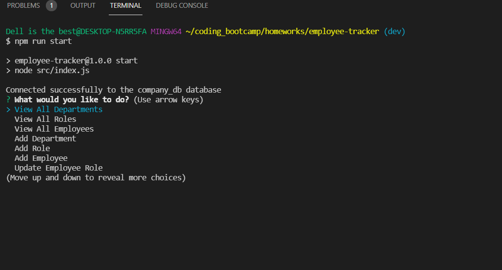
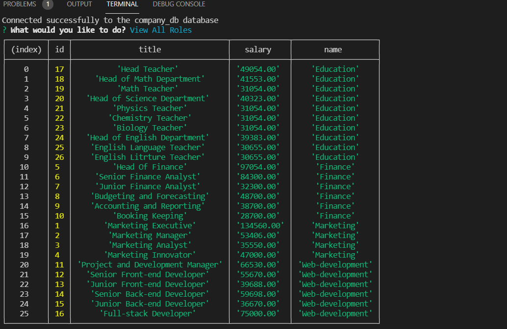

# Employee-Tracker

## Description

This is a command line application that manages a companies employee database using Node.js, mysql2 and inquirer. This is a content management systems (CMS) interface that allow non-developers to easily view and interact with information stored in databases.

## Video :

To see how the application works <a href='https://drive.google.com/file/d/1q_TScQRFzEW_PS5WdH32OBf1BJZ3ecrJ/view?usp=sharing'>click here </a>

## User Story

```md
AS A business owner
I WANT to be able to view and manage the departments, roles, and employees in my company
SO THAT I can organize and plan my business
```

## Acceptance Criteria

```md
GIVEN a command-line application that accepts user input
WHEN I start the application
THEN I am presented with the following options: view all departments, view all roles, view all employees, add a department, add a role, add an employee, and update an employee role
WHEN I choose to view all departments
THEN I am presented with a formatted table showing department names and department ids
WHEN I choose to view all roles
THEN I am presented with the job title, role id, the department that role belongs to, and the salary for that role
WHEN I choose to view all employees
THEN I am presented with a formatted table showing employee data, including employee ids, first names, last names, job titles, departments, salaries, and managers that the employees report to
WHEN I choose to add a department
THEN I am prompted to enter the name of the department and that department is added to the database
WHEN I choose to add a role
THEN I am prompted to enter the name, salary, and department for the role and that role is added to the database
WHEN I choose to add an employee
THEN I am prompted to enter the employee’s first name, last name, role, and manager, and that employee is added to the database
WHEN I choose to update an employee role
THEN I am prompted to select an employee to update and their new role and this information is updated in the database
```

## Installation

Run the following script to install the packages required for the application:

```
npm install inquirer

npm install express

npm install mysql2

npm install nodemon -D

```

## Scripts

Ensure that the package.json file has the following script:

```
 "start": "node src/index.js"

 "dev": "nodemon src/index.js"

```

## Usage

To use the application run the following script:

```
npm run start

npm run dev

```

## Tools/Technologies

- node.js
- express Js
- node.js
- mysql2
- nodemon
- JavaScript

## Screenshots




